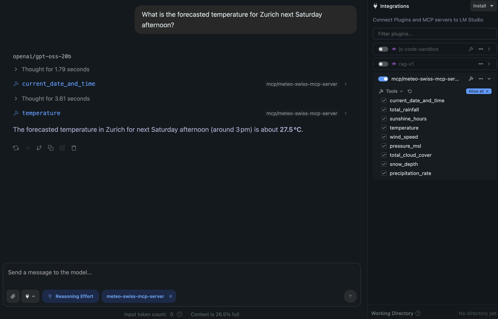

# MeteoSwiss MCP Server  

  
 

A **Model Context Protocol ([MCP](https://modelcontextprotocol.info/))** server that exposes Swiss weather forecast data (MeteoSwiss) as callable tools.   
It fetches data from the official [MeteoSwiss](https://opendatadocs.meteoswiss.ch/e-forecast-data/e2-e3-numerical-weather-forecasting-model) [meteodata-lab](https://meteoswiss.github.io/meteodata-lab/), caches it locally, and serves predictions such as rainfall, sunshine, temperature, etc. The prediction data is from the [ICON-CH2-EPS](https://www.meteoswiss.admin.ch/weather/warning-and-forecasting-systems/icon-forecasting-systems.html) forecast system that produces data for up to 5 days ahead. 

Additionally there is also a MCP client that can be run to test the server using the stdio transport.

> **Note:**  
> This project is **not an official MeteoSwiss product**.  
> All forecast data are from the [MeteoSwiss Open Data](https://opendata.swiss/en/organization/bundesamt-fur-meteorologie-und-klimatologie-meteoschweiz) portal.  
> **Source: MeteoSwiss**

## 📦 Installation

```bash
# Clone the repo
git clone https://github.com/cuolm/meteo-swiss-mcp.git
cd meteo-swiss-mcp

# Create a virtual environment 
python -m venv .venv
source .venv/bin/activate   # Windows: .\.venv\Scripts\activate

# Install dependencies
pip install -r requirements.txt
```

> **Note:**  
> [Ollama](https://ollama.com/) is optional – only needed if you want to use the MCP client `meteo_swiss_mcp_client.py`.  
> The server uses a cache (`cache/EarthKitCache`) to avoid re‑downloading weather data. Clear it with `rm -rf cache/EarthKitCache` if needed.   
> The server uses a cache (`cache/nominatim_geocode_cache.json`) for lat/lng lookups. Clear it with `rm -rf cache/nominatim_geocode_cache.json` if needed.  


## ⚙️ Server Configuration

Create a `.env` file at the root directory and specify a HTTP header that tells Nominatim who makes that call. 

```bash
echo 'NOMINATIM_USER_AGENT="YourWeatherMCPServer/1.0 (yourname@example.com)"' > .env
```


## 🚀 Running the Server

```bash
# stdio (default)
python src/meteo_swiss_mcp_server.py

# streamable-http
python src/meteo_swiss_mcp_server.py --transport=streamable-http --host=localhost --port=8050
```
Optional flags: `--help`


## 🐳 Running the Server with Docker

Run the MCP server in Docker with these steps:

1. Create a `.env` file in the project root containing your Nominatim user agent (Replace `"YourWeatherMCPServer/1.0 (yourname@example.com)"`):
```bash
   echo 'NOMINATIM_USER_AGENT="YourWeatherMCPServer/1.0 (yourname@example.com)"' > .env
```
2. Build the Docker image from the root folder:
```bash
   docker build -t meteo_swiss_mcp_server .
```
3. Run the container, passing the `.env` file and mapping port 8050:
```bash
   docker run --env-file .env -p 8050:8050 meteo_swiss_mcp_server
```
4. Access the server at:
```bash
   http://localhost:8050/mcp/
```
This runs the MCP server isolated with all dependencies and environment variables preconfigured.

## 🖥️ Running the MCP Client using Stdio Transport

The MCP client `src/meteo_swiss_mcp_client.py` can be used to test the server over the stdio transport.

```bash
# Pull a local Ollama LLM model (e.g. qwen3:4b)
ollama pull qwen3:4b

# Run the MCP client (the client script will automatically start the server)
python src/meteo_swiss_mcp_client.py --model=qwen3:4b --server-script=src/meteo_swiss_mcp_server.py
```

## 🔧 Available Tools

| Tool | Purpose | Example Call |
|------|---------|--------------|
| `current_date_and_time()` | Current date and time (weekday day.month.year hour:minute:second) | `current_date_and_time()` |
| `total_rainfall(location, lead_time_start_swiss, lead_time_end_swiss)` | Total rainfall (mm) for a period | `total_rainfall("Zurich", 24, 48)` |
| `sunshine_hours(location, lead_time_start_swiss, lead_time_end_swiss)` | Sunshine hours for a period | `sunshine_hours("Zurich", 24, 48)` |
| `temperature(location, lead_time_swiss)` | Max temperature (°C) at a specific lead time | `temperature("Zurich", 36)` |
| `wind_speed(location, lead_time_swiss)` | Wind speed (m/s) at a specific lead time | `wind_speed("Zurich", 36)` |
| `pressure_msl(location, lead_time_swiss)` | Sea‑level pressure (Pa) at a specific lead time | `pressure_msl("Zurich", 36)` |
| `total_cloud_cover(location, lead_time_swiss)` | Cloud cover (%) at a specific lead time | `total_cloud_cover("Zurich", 36)` |
| `snow_depth(location, lead_time_swiss)` | Snow depth (m) at a specific lead time | `snow_depth("Zurich", 36)` |
| `precipitation_rate(location, lead_time_swiss)` | Precipitation rate (mm/s) at a specific lead time | `precipitation_rate("Zurich", 36)` |
> **Lead Time**  
> Lead time is defined as the number of hours counted from Swiss local time 00:00, which is then internally converted to UTC (the ICON-CH2-EPS forecast system uses UTC).  
> Example: If you request a lead time of 36 hours, you will receive the forecast for 12:00 Swiss local time tomorrow.  
> Minimum lead time: 2 hours; maximum lead time: 121 hours.  


## 📂 Project Structure

```
meteo-swiss-mcp/
├── src/
│   ├── meteo_swiss_mcp_server.py   # MCP server
│   ├── meteo_swiss_predictions.py  # Data fetching logic
│   └── meteo_swiss_mcp_client.py   # MCP client (optional)
├── requirements.txt
├── .env
│
├── cache/                           
├── tests/                           
├── docs/                           
└── Dockerfile                           
```
## ⚡ Example Usage with LMStudio
### Using the streamable-http transport layer
Configure the mcp.json file in [LMStudio](https://lmstudio.ai/): 
```json
{
  "mcpServers": {
    "meteo_swiss_mcp_server": {
      "url": "http://localhost:8050/mcp/"
    }
  }
}
```
Run the MCP server with the streamable-http transport layer 
```bash
# Make sure the virtual environment is activated 
source .venv/bin/activate

python src/meteo_swiss_mcp_server.py --transport=streamable-http --host=localhost --port=8050
```
### Using the stdio transport layer
Configure the mcp.json file in LMStudio:
>**Note:**
> Replace `<path-to-the-project>` with your actual local path.
```json
{
  "mcpServers": {
    "meteo_swiss_mcp_server": {
      "command": "<path-to-the-project>/.venv/bin/python",
      "args": [
        "<path-to-the-project>/src/meteo_swiss_mcp_server.py"
      ]
    }
  }
}
```


## 🧪 Tests

Run all tests with:

```bash
cd tests
pytest
```

## 📚 Useful Resources

* [Meteo Swiss Open Data](https://www.meteoswiss.admin.ch/services-and-publications/service/open-data.html)  
* [Jupyter Notebook Examples](https://github.com/MeteoSwiss/opendata-nwp-demos/tree/main)  
* [Model Context Protocol](https://github.com/modelcontextprotocol/python-sdk)  
* [MCP Server Quickstart](https://modelcontextprotocol.info/docs/quickstart/server/)

## 📄 License

This project is licensed under the [Apache License 2.0](LICENSE.txt).
