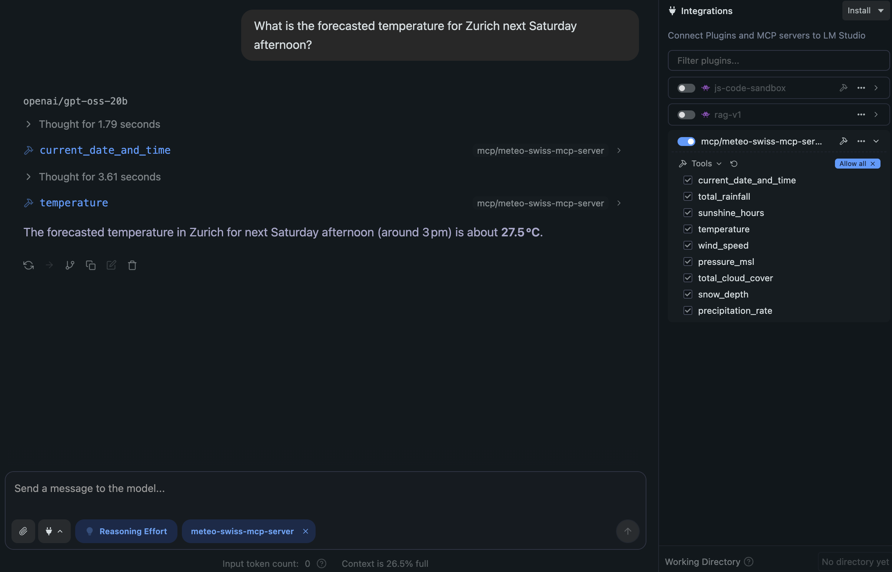

# Swiss Weather MCP Server
[](https://pypi.org/project/swiss-weather-mcp/)
[](/LICENSE.txt)
[](https://github.com/cuolm/swiss-weather-mcp/actions/workflows/release.yaml)
[](https://github.com/cuolm/swiss-weather-mcp/actions/workflows/tests.yaml)

A **Model Context Protocol ([MCP](https://modelcontextprotocol.info/))** server that exposes Swiss weather forecast data as callable tools.
It reads the official [MeteoSwiss local forecast collection](https://opendatadocs.meteoswiss.ch/e-forecast-data/e4-local-forecast-data), caches it locally, and serves predictions such as rainfall, sunshine, temperature, wind and a worded weather summary. MeteoSwiss publishes these forecasts for **5,614 Swiss locations** (weather stations, postal code areas and points of interest), for **today and the next 8 days**, refreshed **every hour**.

Additionally there is also an MCP client that can be run to test the server using the stdio transport.

> **Note:** This project is **not an official MeteoSwiss product**. All forecast data are from the
> [MeteoSwiss Open Data](https://opendata.swiss/en/organization/bundesamt-fur-meteorologie-und-klimatologie-meteoschweiz) portal. **Source: MeteoSwiss**

## Table of Contents
- [Project Structure](#project-structure)
- [Quick Start](#quick-start)
- [Installation](#installation)
- [Usage](#usage)
- [Available Tools](#available-tools)
- [Example Usage with LMStudio](#example-usage-with-lmstudio)
- [Tests](#tests)
- [Releasing](#releasing)
- [Resources](#resources)
- [License](#license)

## Project Structure
```text
swiss-weather-mcp/
├── src/swiss_weather_mcp/
│   ├── server.py           # MCP server
│   ├── forecast.py         # Weather values, units and aggregation
│   ├── meteoswiss.py       # MeteoSwiss data source, caching and location lookup
│   ├── parameters.py       # MeteoSwiss parameter codes and pictogram meanings
│   └── client.py           # MCP client (optional)
├── tests/swiss_weather_mcp/  # Tests
├── .github/workflows/      # CI and release pipelines
├── docs/                   # Documentation
├── pyproject.toml          # Project metadata and dependencies
├── uv.lock                 # Pinned, reproducible dependency set
└── Dockerfile
```
Caches live outside the project, under your OS's standard cache directory (see [Installation](#installation)).

## Quick Start

### 1. Installation
Install the server globally to run it anywhere on your system:
```bash
uv tool install swiss-weather-mcp
```

### 2. Execution
```bash
swiss-weather-mcp-server
```
No configuration is needed, the server reads everything it requires from MeteoSwiss.

## Installation

### As a Global CLI Tool
```bash
uv tool install swiss-weather-mcp

# With the optional MCP client, which pulls in the OpenAI SDK
uv tool install 'swiss-weather-mcp[client]'
```

### As a Library Dependency
```bash
# Using uv
uv add swiss-weather-mcp

# Using pip
pip install swiss-weather-mcp

# With the optional MCP client, which pulls in the OpenAI SDK
uv add 'swiss-weather-mcp[client]'
pip install 'swiss-weather-mcp[client]'
```

### From Source
```bash
git clone https://github.com/cuolm/swiss-weather-mcp.git
cd swiss-weather-mcp

# Using uv (Recommended)
uv sync --extra client

# Using pip
python3 -m venv .venv
source .venv/bin/activate  # On Windows: .venv\Scripts\activate
pip install -e ".[client]"
```

> **Note:** `uv sync` installs the server only. `--extra client` adds the OpenAI SDK needed by
> `swiss-weather-mcp-client`.

> **Note:**
> - `llama-server` must already be running when you start `swiss-weather-mcp-client`, which talks to it
>   but never starts it. The MCP server itself does not need it.
> - Caches live in your OS cache directory (via [platformdirs](https://github.com/tox-dev/platformdirs),
>   e.g. `~/Library/Caches/swiss-weather-mcp` on macOS, `~/.cache/swiss-weather-mcp` on Linux),
>   independent of where the server runs. Set `SWISS_WEATHER_MCP_CACHE_DIR` to put them elsewhere, or
>   delete the directory to clear them. Forecast files sit in one folder per model run, named by the
>   run's time in UTC, such as `runs/202609231100`.

## Usage

### Running the Server
If installed via `uv tool install` or `pip`:
```bash
# stdio (default)
swiss-weather-mcp-server

# streamable-http
swiss-weather-mcp-server --transport=streamable-http --host=localhost --port=8050
```

If running within the source repository cloned from GitHub:
```bash
# Using uv (Recommended)
uv run swiss-weather-mcp-server

# Using pip, with the virtual environment activated
swiss-weather-mcp-server
```
Optional flags: `--help`

> **Note:** By default the server keeps only the rows for the location you asked about, a few
> kilobytes per parameter. Pass `--cache-all-locations` to keep the whole published file instead
> (about 31 MB per parameter), which makes questions about further locations need no new download.

### Running the Server with Docker
Images are built and published automatically by GitHub Actions to the project's [GitHub Container Registry](https://ghcr.io/cuolm/swiss-weather-mcp), tagged `:latest` (newest release) and by version.

1. Run the published image, mapping port 8050:
   ```bash
   docker run -p 8050:8050 ghcr.io/cuolm/swiss-weather-mcp:latest
   ```
2. Access the server at:
   ```bash
   http://localhost:8050/mcp/
   ```

> **Note:** The cache lives inside the container and is lost when it stops. Mount a volume to keep it
> across restarts, for example `-v swiss-weather-cache:/root/.cache/swiss-weather-mcp`.

#### Manual Build
```bash
docker build -t swiss-weather-mcp .
docker run -p 8050:8050 swiss-weather-mcp
```

### Running the MCP Client using Stdio Transport
The bundled MCP client can be used to test the server over the stdio transport. It requires the `client` extra (see [Installation](#installation)). The client starts the MCP server itself, but not the model server, which has to be running first.

1. Install [llama.cpp](https://github.com/ggml-org/llama.cpp), which provides `llama-server`:
   ```bash
   brew install llama.cpp
   ```
2. Start it in its own terminal, downloading the model on first use:
   ```bash
   llama-server --jinja --no-mmproj -hf unsloth/Qwen3.5-4B-GGUF --port 8080
   ```
3. Run the client against it in a second terminal:
   ```bash
   swiss-weather-mcp-client --model=unsloth/Qwen3.5-4B-GGUF --base-url=http://localhost:8080/v1

   # From a source checkout, using uv
   uv run --extra client swiss-weather-mcp-client --model=unsloth/Qwen3.5-4B-GGUF --base-url=http://localhost:8080/v1
   ```

> **Note:** `--jinja` applies the model's chat template, without which tool calling is unsupported, and
> `--no-mmproj` skips the vision projector that `-hf` downloads alongside some models. `--base-url`
> defaults to `llama-server`'s address, and any other OpenAI compatible backend works by pointing it
> elsewhere, for example [LM Studio](https://lmstudio.ai/) or [vLLM](https://docs.vllm.ai/). Pass
> `--model` exactly as the server reports it under `/v1/models`.

## Available Tools

The forecast tools take a `location` (a name such as `"Zurich"`, or a Swiss postal code such as `"8001"`)
and a Swiss local time, or a date for `daily_forecast`. They return the value together with the location
they resolved, its altitude, the time or day it applies to, and the model run the forecast came from.

| Tool | Purpose | Example Call |
|------|---------|--------------|
| `current_date_and_time()` | Today's weekday and the Swiss time now, in the form the tools accept | `current_date_and_time()` |
| `daily_forecast(location, date)` | Whole day: lowest and highest hourly temperature, median rainfall with its 10th and 90th percentile, daytime weather in words | `daily_forecast("Zurich", "2026-09-23")` |
| `weather_description(location, when)` | The weather in words for the 3 hours up to that time, e.g. "mostly sunny, some clouds" | `weather_description("Zurich", "2026-09-23T14:00")` |
| `temperature(location, when)` | Air temperature (°C), mean of the hour up to that time, 2 m above ground | `temperature("Zurich", "2026-09-23T14:00")` |
| `total_rainfall(location, start, end)` | Median rainfall (mm) of each hour, summed over a period | `total_rainfall("Zurich", "2026-09-23T06:00", "2026-09-23T18:00")` |
| `sunshine_hours(location, start, end)` | Sunshine (h) summed over a period | `sunshine_hours("Zurich", "2026-09-23T06:00", "2026-09-23T18:00")` |
| `precipitation_probability(location, when)` | Chance of rain (%) over the 3 hours up to that time | `precipitation_probability("Zurich", "2026-09-23T14:00")` |
| `precipitation_rate(location, when)` | Median rainfall (mm) in the hour up to that time | `precipitation_rate("Zurich", "2026-09-23T14:00")` |
| `wind_speed(location, when)` | Wind speed (km/h), mean of the hour up to that time | `wind_speed("Zurich", "2026-09-23T14:00")` |
| `wind_gusts(location, when)` | Strongest one-second gust (km/h) in the hour up to that time | `wind_gusts("Säntis", "2026-09-23T14:00")` |
| `wind_direction(location, when)` | Direction the wind blows from, in degrees and as a compass point | `wind_direction("Zurich", "2026-09-23T14:00")` |
| `total_cloud_cover(location, when)` | Estimated total cloud cover (%) plus the low, medium and high layers | `total_cloud_cover("Zurich", "2026-09-23T14:00")` |
| `freezing_level(location, when)` | Height of the 0 °C line (m above sea level) | `freezing_level("Zermatt", "2026-09-23T14:00")` |

**Time**
- Send times as Swiss clock time in ISO 8601 without an offset, e.g. `"2026-09-23T14:00"`. The server
  applies summer or winter time for that date itself. An explicit offset is honoured.
- All times in the answers are ISO 8601 Swiss local time with the UTC offset, e.g.
  `2026-09-23T13:00+02:00`. The `+02:00` shows the difference to UTC: `+02:00` in summer, `+01:00` in winter.
- MeteoSwiss stamps an hourly average or sum at the end of its hour, so `14:00` means 13:00 to 14:00,
  and a period from `start` to `end` covers exactly the hours in between. Cloud cover and the freezing
  level are values at that moment instead.
- The forecast covers today and the next 8 days.

> **Note:** Ask `current_date_and_time()` first when the question is relative, such as "tomorrow" or
> "tonight", because the tools take a real date rather than an offset.

> **Note:** A location must be one of the places MeteoSwiss publishes. Names are matched exactly,
> ignoring case and accents, so `zurich` finds `Zürich` but a region such as `Tessin` does not match
> and is rejected rather than guessed at. A city covers several postal code areas and resolves to the
> lowest one, which is not always its centre (Bern's lowest is 3004, its old town 3011). The answer
> names the point it used, and a postal code picks a specific district.

> **Note:** `daily_forecast` is by far the cheapest tool, about 8 MB against about 31 MB per hourly
> parameter, so prefer it when the question is about a day rather than an hour. `total_cloud_cover`
> is the most expensive because it reads three files.

> **Note:** MeteoSwiss calculates many slightly different possible outcomes, not just one forecast.
> Temperature and rain are the median of these outcomes: half lie below it and half above. If the
> possible temperatures at 14:00 are 18, 19, 20, 21 and 23 °C, the median is 20 °C. It is not the most
> likely value. Medians do not add up: when showers are possible but unlikely in any single hour,
> every hourly amount is 0, while the day as a whole still has a median of several millimetres. Ask
> `daily_forecast` for the rain of a day, not `total_rainfall`.

## Example Usage with LMStudio

### Using the streamable-http transport layer
Configure the mcp.json file in [LMStudio](https://lmstudio.ai/):
```json
{
  "mcpServers": {
    "swiss_weather_mcp_server": {
      "url": "http://localhost:8050/mcp/"
    }
  }
}
```
Run the MCP server with the streamable-http transport layer:
```bash
uv run swiss-weather-mcp-server --transport=streamable-http --host=localhost --port=8050
```

### Using the stdio transport layer
Configure the mcp.json file in LMStudio. Replace `<path-to-the-project>` with your actual local path:
```json
{
  "mcpServers": {
    "swiss_weather_mcp_server": {
      "command": "<path-to-the-project>/.venv/bin/swiss-weather-mcp-server"
    }
  }
}
```


## Tests
Run the tests from the project root with:
```bash
uv run pytest

# Or, with an activated virtual environment
pytest
```

Check the code style with ruff and the type hints with mypy. mypy also checks the client, so install its extra first:
```bash
uv sync --group dev --extra client
uv run ruff check
uv run mypy
```

Every push and pull request runs the tests, ruff, mypy and a Docker build check via the [Tests workflow](.github/workflows/tests.yaml).

## Releasing

Versions are derived from Git tags by `hatch-vcs` — there is no version string to bump by hand.

- Pushing a pre-release tag (e.g. `0.2.0rc1`) triggers [`release_test.yaml`](.github/workflows/release_test.yaml): tests, publish to **TestPyPI**, push a versioned image to GHCR, and create a prerelease GitHub Release.
- Pushing a final tag (e.g. `0.2.0`) triggers [`release.yaml`](.github/workflows/release.yaml): tests, publish to **PyPI**, push `:<version>` and `:latest` images to GHCR, and create a GitHub Release.

Both publish jobs use PyPI [trusted publishing](https://docs.pypi.org/trusted-publishers/) via the `pypi` / `testpypi` GitHub environments — no API tokens are stored in the repository.

## Resources
- [Meteo Swiss Open Data](https://www.meteoswiss.admin.ch/services-and-publications/service/open-data.html)
- [Local Forecast Notebook Examples](https://github.com/MeteoSwiss/opendata-localforecast-demos)
- [Model Context Protocol](https://github.com/modelcontextprotocol/python-sdk)
- [MCP Server Quickstart](https://modelcontextprotocol.info/docs/quickstart/server/)

## License
Licensed under the [Apache License 2.0](/LICENSE.txt).
